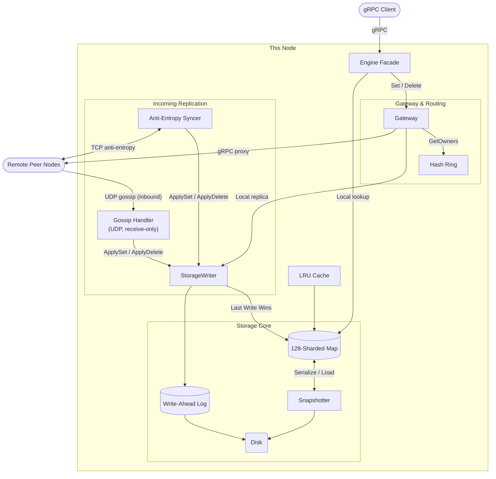
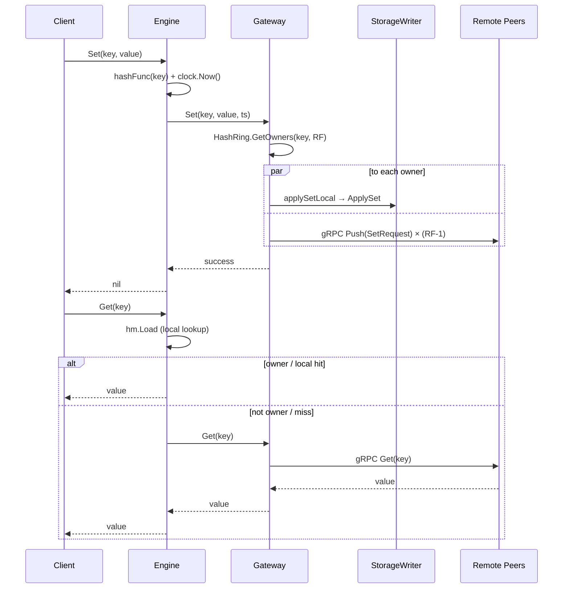
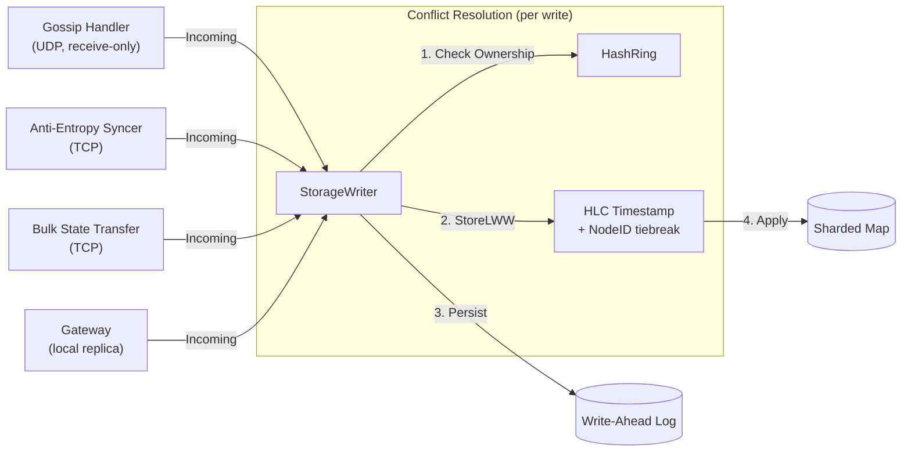

# Distributed Key-Value Store

dkv is a partitioned, state-replicated key-value database implemented in Go. In CAP theorem, dkv is AP in the style of Cassandra or ScyhllaDB. 

## Features

* Consistent-hash partitioning and direct write replication
* Gossip membership propagation
* Hybrid logical clock (HLC) LWW conflict resolution
* 3-level Merkle tree anti-entropy state synchronization
* Multi-segment write-ahead log (WAL) crash durability
* High-concurrency sharded memory map (128 independent locks)
* Active snapshot persistence and recovery serialization
* Dynamic LRU cache TTL eviction
* gRPC Client and Server API

## System Architecture





### Incoming Replication & Conflict Resolution
How external updates are merged into the local node via `StorageWriter` using atomic Last-Write-Wins (LWW).



## Quick Start

Start a dkv server node:
```bash
go run examples/server/main.go
```

In a separate terminal, run the client example to set, get, and delete values:
```bash
go run examples/client/main.go
```

## Performance & Benchmarks

The dkv engine is benchmarked locally using Go's built-in testing framework on an Apple M4 Max (darwin/arm64, 14 cores, Go 1.26.3):

### 1. Core Storage Engine (Direct CRUD)
Micro-benchmarks measuring direct storage interaction with the 128-sharded memory store and active Write-Ahead Logging (WAL):

| Benchmark | Throughput (ops/sec) | Latency | Allocations |
| :--- | :--- | :--- | :--- |
| Get (Parallel) | ~41,702,000 | 14.78 ns/op | 0 B/op (0 allocs) |
| Get (Single-thread) | ~12,068,000 | 48.01 ns/op | 0 B/op (0 allocs) |
| Set (Parallel + WAL) | ~1,942,000 | 292.20 ns/op | 0 B/op (0 allocs) |
| Set (Single-thread + WAL) | ~1,614,000 | 368.20 ns/op | 0 B/op (0 allocs) |
| Delete (Parallel + WAL) | ~2,457,000 | 232.50 ns/op | 0 B/op (0 allocs) |
| Delete (Single-thread + WAL) | ~1,365,000 | 440.50 ns/op | 0 B/op (0 allocs) |

### 2. Multi-tier Merkle Tree & Anti-Entropy Sync
Reconciliation and anti-entropy sync performance across node boundaries:

| Operation | Latency | Allocations | Key Insight |
| :--- | :--- | :--- | :--- |
| Root Digest Generation | 245.50 ns | 0 B/op (0 allocs) | Global state integrity checked in fraction of a microsecond |
| Fill Shard Digests | 711.10 ns | 0 B/op (0 allocs) | Builds intermediate 128-sharding bounds with zero allocations |
| Sync Pull (Identical States) | 257.40 ns | 0 B/op (0 allocs) | Zero-copy validation when nodes are fully synchronized |
| Sync Pull (Single Mismatch) | 4.79 μs | 481 B/op (5 allocs) | Rapid single-shard branch pruning for minor state drift |
| Sync Pull (Full Divergence) | 32.79 μs | 36,607 B/op (286 allocs) | High-concurrency heavy synchronization of drifted states |

### 3. Payload Size Scalability
Measures direct `Set` latency scaling under varying key-value payload sizes:

* Small Payload (128 Bytes): 387.40 ns/op (0 B/op, 0 allocs)
* Medium Payload (4 KB): 1.07 μs/op (0 B/op, 0 allocs)
* Large Payload (1 MB): 185.82 μs/op (0 B/op, 0 allocs) — *Maintains zero heap allocation escaping!*

### 4. Snapshotting & Recovery Durability
Measures background disk serialization and startup WAL replay times:

* State Snapshotting: ~77.02 ms to serialize full memory database (2,210 B/op, 26 allocations)
* Full Crash Recovery: ~5.21 ms to load Gob snapshots and fully replay segment logs from disk (reconstitutes 115,639 memory allocations safely)

---

To run the full benchmark suite locally:
```bash
go test -bench=. -benchmem ./...
```

## Profiling

### CPU
```bash
go test -bench . -cpuprofile=cpu.prof
go tool pprof -http=:8000 cpu.prof
```

### Memory
```bash
go test -bench . -memprofile=mem.prof
go tool pprof -http=:8000 mem.prof
