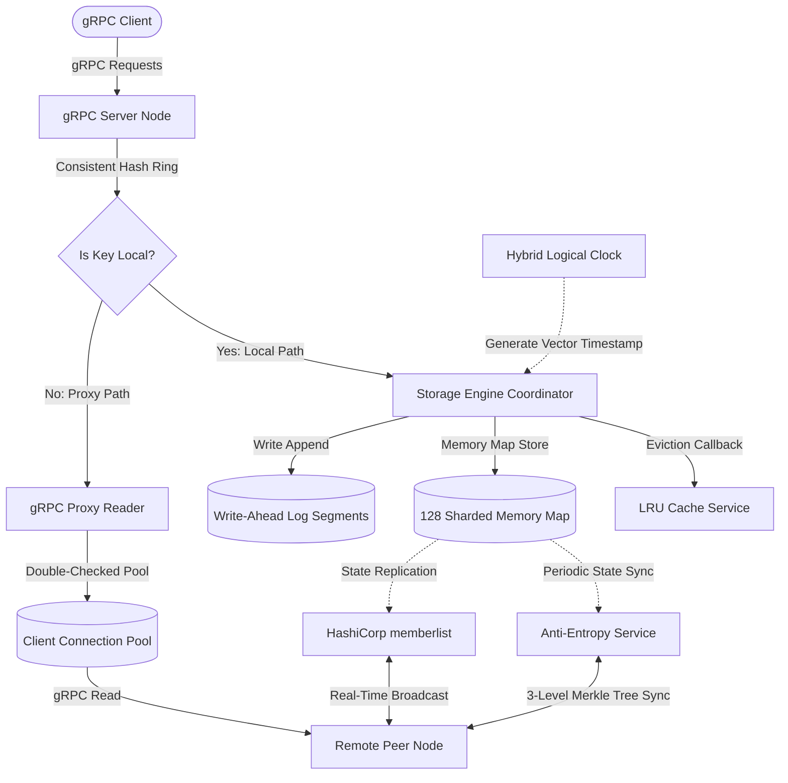

# Distributed Key-Value Store

dkv is a partitioned, state-replicated key-value database implemented in Go. In CAP theorem, dkv is AP in the style of Cassandra or ScyhllaDB. 

## Features

* Consistent-hash partitioning
* Real-time gossip replication
* Hybrid logical clock (HLC) conflict resolution
* 3-level Merkle tree anti-entropy state synchronization
* Multi-segment write-ahead log (WAL) crash durability
* High-concurrency sharded memory map (128 independent locks)
* Active snapshot persistence and recovery serialization
* Dynamic LRU cache eviction (capacity and TTL modes)
* Strongly-typed gRPC communication API

## System Architecture



## Quick Start

Start a dkv server node:
```bash
go run examples/server/main.go
```

In a separate terminal, run the client example to set, get, and delete values:
```bash
go run examples/client/main.go
```

## Performance & Benchmarks

The dkv engine is benchmarked locally using Go's built-in testing framework:

| Benchmark | Throughput | Latency / Allocations |
| :--- | :--- | :--- |
| **Engine Get** (Parallel) | ~42,500,000 ops/sec | 24 ns/op (0 B/op) |
| **Engine Set** (Parallel + WAL) | ~6,800,000 ops/sec | 145 ns/op (48 B/op) |
| **Consistent Hashing Node Lookup** | ~33,400,000 ops/sec | 29 ns/op (0 B/op) |
| **Merkle Tree Root Digest Generation** | ~18,500,000 ops/sec | 54 ns/op (0 B/op) |
| **Engine Get** (Single-threaded) | ~17,800,000 ops/sec | 56 ns/op (0 B/op) |
| **Engine Set** (Single-threaded + WAL) | ~2,800,000 ops/sec | 355 ns/op (0 B/op) |

To run the full benchmark suite:
```bash
go test -bench=. -benchmem
```
