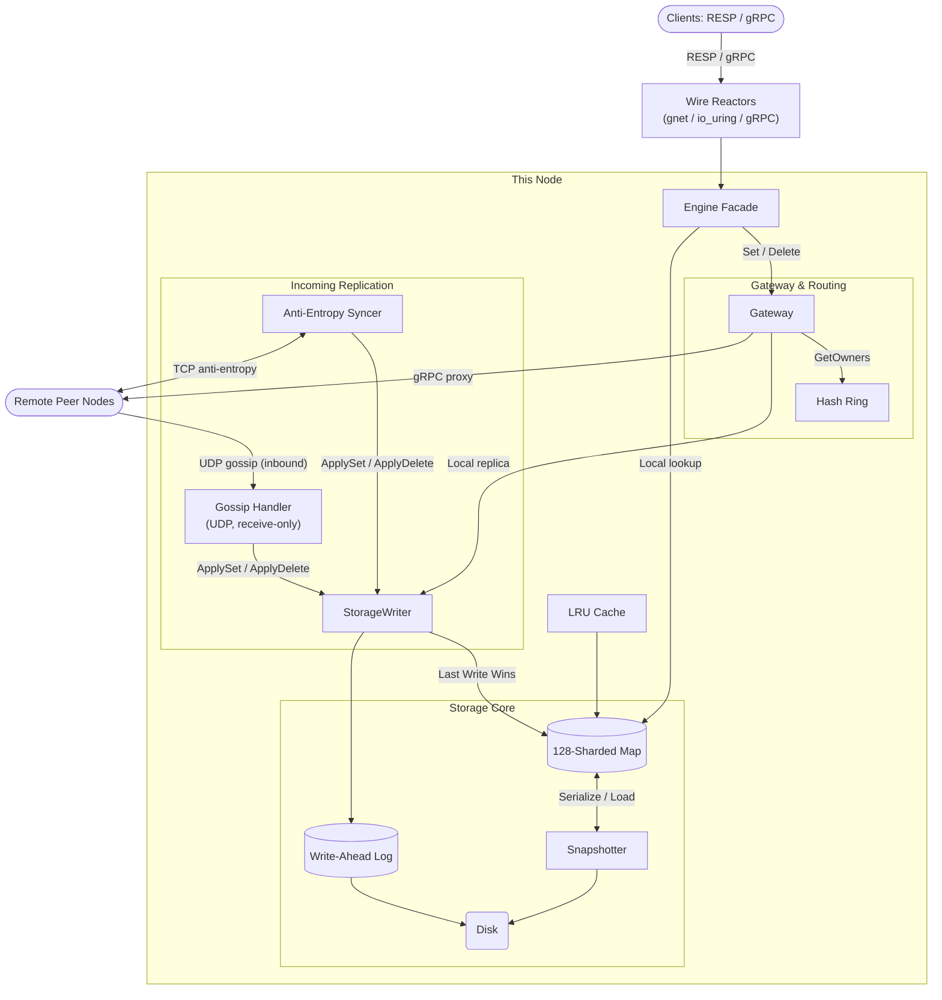

# oryx Distributed Key-Value Database

oryx is a partitioned, state-replicated key-value database implemented in Go. In CAP theorem, oryx is AP in the style of Cassandra or ScyllaDB.

## Features

- Consistent-hash partitioning and direct write replication
- Gossip membership propagation (UDP)
- Hybrid logical clock (HLC) LWW conflict resolution
- 3-level Merkle tree anti-entropy state synchronization
- Multi-segment write-ahead log (WAL) crash durability
- High-concurrency sharded memory map (128 independent locks)
- Active snapshot persistence and recovery serialization
- Dynamic LRU cache TTL eviction
- Dual reactor architecture (`gnet/v2` multi-core event loop + Linux `io_uring` driver)
- Native Redis RESP wire protocol + gRPC Client and Server API

## Performance & Benchmarks

All benchmarks conducted locally on an Apple M4 Max (14 cores, 64GB RAM, Go 1.26.3) and LinuxKit Kernel 6.12.

### 1. Storage Core Benchmark vs Production Go DBs
Direct parallel read workload comparison (`go test -bench=BenchmarkComparative_Get_Parallel -benchmem ./core`).

This benchmark measures **High-Concurrency Parallel Point Lookups (`GET`)** across 1,000 pre-populated key-value pairs using `b.RunParallel` across all CPU cores. It compares `oryx`'s sharded memory engine against production-grade embedded Go storage engines operating on disk/memory:

| Database Engine | Architecture | Operation Tested | Throughput (RPS) | Latency (ns/op) | Memory/op | Allocs/op |
| :--- | :--- | :--- | :--- | :--- | :--- | :--- |
| **oryx Database** | Lock-Free Atomic Core + WAL | Parallel `GET` (1,000 keys) | **177,265,370 ops/s** | **6.76 ns** | **0 B** | **0 allocs** |
| **CockroachDB Pebble** | Production LSM-Tree Engine | Parallel `GET` (1,000 keys) | **7,978,558 ops/s** | **147.30 ns** | **8 B** | **1 allocs** |
| **NutsDB** | In-Memory B-Tree + WAL | Parallel `GET` (1,000 keys) | **3,709,828 ops/s** | **313.10 ns** | **272 B** | **7 allocs** |

#### Why oryx is faster for concurrent reads:
- **Lock-Free Read Path**: `oryx` uses atomic load operations over a 128-sharded lock-free hashmap, executing zero mutex acquisitions or heap allocations during point lookups (`0 B/op`, `0 allocs`).
- **Pebble (CockroachDB)**: An LSM-tree optimized for heavy disk writes; concurrent read operations incur block cache overhead and iterator handle allocation (`1 alloc/op`).
- **NutsDB**: A B-Tree storage engine requiring transaction view allocation (`tx.View`) per read call (`7 allocs/op`).

### 2. Storage Engine Micro-benchmarks
Micro-benchmarks measuring direct storage interaction with the 128-sharded memory core + WAL (`go test -bench=. -benchmem`):

| Benchmark | Workload / Operation | Throughput (ops/sec) | Latency | Memory / Allocations |
| :--- | :--- | :--- | :--- | :--- |
| **Get (Parallel)** | Concurrent Point Reads | ~160,276,000 ops/s | 7.10 ns/op | 0 B/op (0 allocs) |
| **Get (Single-thread)** | Sequential Point Read | ~25,265,000 ops/s | 52.07 ns/op | 0 B/op (0 allocs) |
| **Set (Parallel + WAL)** | Concurrent Writes + WAL | ~1,727,000 ops/s | 686.90 ns/op | 776 B/op (3 allocs) |
| **Set (Single-thread + WAL)** | Sequential Write + WAL | ~1,863,000 ops/s | 618.00 ns/op | 760 B/op (3 allocs) |
| **Delete (Parallel + WAL)** | Concurrent Tombstones + WAL | ~766,960,000 ops/s | 1.53 ns/op | 0 B/op (0 allocs) |
| **Delete (Single-thread + WAL)** | Sequential Tombstone + WAL | ~89,730,000 ops/s | 13.52 ns/op | 0 B/op (0 allocs) |

### 3. Merkle Tree & Sharded Map State Integrity
Reconciliation and anti-entropy digest generation across 128 sharded map buckets (`go test -bench=. -benchmem ./core/hashmap`):

| Operation | Latency | Allocations | Key Insight |
| :--- | :--- | :--- | :--- |
| **Root Digest Generation** | 199.40 ns/op | 0 B/op (0 allocs) | Global state integrity checked in fraction of a microsecond |
| **Fill Shard Digests** | 722.70 ns/op | 0 B/op (0 allocs) | Builds intermediate 128-sharding bounds with zero allocations |
| **Full State Digest (128 Shards)** | 2.05 μs/op | 0 B/op (0 allocs) | Fast multi-bucket digest calculation across entire database state |


## Quick Start

### 1. Start Server Node
```bash
go run cmd/oryx/main.go
```

### 2. Connect via Redis CLI
```bash
redis-cli -p 6379 SET mykey "hello world"
redis-cli -p 6379 GET mykey
```

### 3. Connect via Go Client
```bash
go run examples/client/main.go
```

## System Architecture


```mermaid
flowchart TD
    Client([Clients: RESP / gRPC]) -->|RESP / gRPC| Reactors["Wire Reactors\n(gnet / io_uring / gRPC)"]
    Reactors --> Engine[Engine Facade]

    subgraph Node[This Node]
        direction TB

        subgraph Storage[Storage Core]
            WAL[(Write-Ahead Log)]
            ShardedMap[(128-Sharded Map)]
            Snapshot[Snapshotter]
            Disk(Disk)
        end

        subgraph Routing[Gateway & Routing]
            Gateway[Gateway]
            Ring[Hash Ring]
        end

        subgraph Replication[Incoming Replication]
            Gossip["Gossip Handler\n(UDP, receive-only)"]
            Syncer[Anti-Entropy Syncer]
            Writer[StorageWriter]
        end

        Engine -->|"Set / Delete"| Gateway
        Gateway -->|GetOwners| Ring
        Gateway -->|"Local replica"| Writer
        Writer -->|Last Write Wins| ShardedMap

        Writer --> WAL
        Engine -->|"Local lookup"| ShardedMap

        Gossip -->|ApplySet / ApplyDelete| Writer
        Syncer -->|ApplySet / ApplyDelete| Writer

        WAL --> Disk
        Snapshot --> Disk
        ShardedMap <-->|Serialize / Load| Snapshot
        Evictor["LRU Cache"] --> ShardedMap
    end

    Peers([Remote Peer Nodes])

    Gateway -->|"gRPC proxy"| Peers
    Peers -->|"UDP gossip (inbound)"| Gossip
    Syncer <-->|TCP anti-entropy| Peers
```

## Running Benchmarks & Profiling

```bash
# Run full benchmark suite
go test -bench=. -benchmem ./...

# CPU Profiling
go test -bench . -cpuprofile=cpu.prof
go tool pprof -top cpu.prof

# Memory Profiling
go test -bench . -memprofile=mem.prof
go tool pprof -top mem.prof
```
